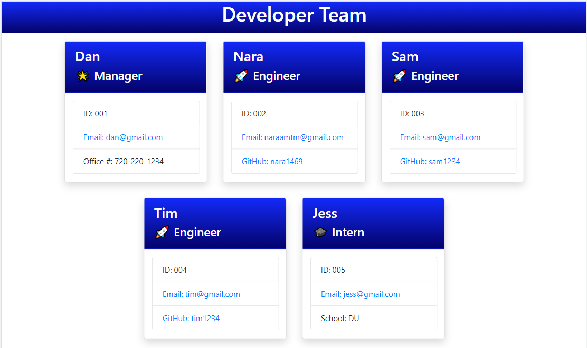
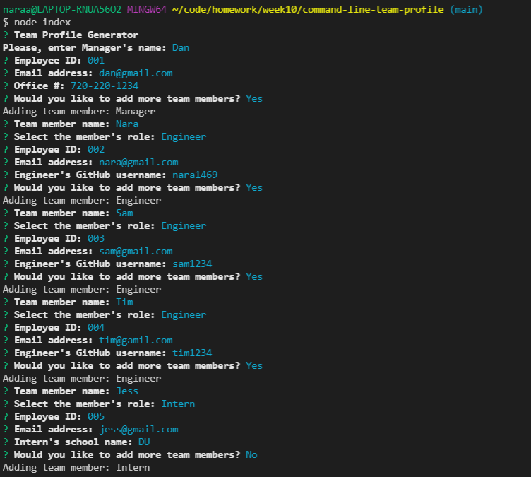
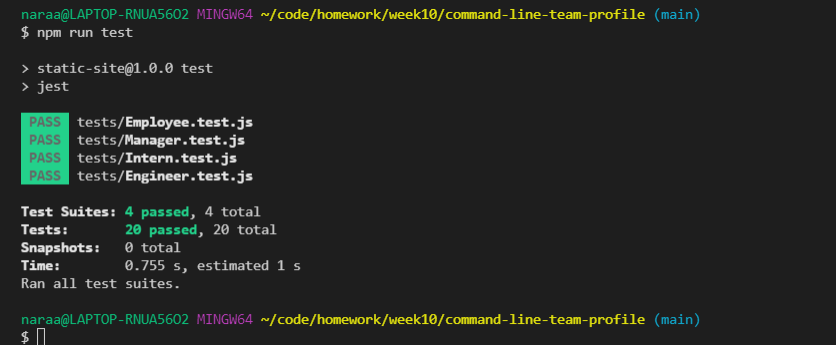

# team-profile-generator

Bootcamp Week 10: Homework

# 10 Object-Oriented Programming: Team Profile Generator

## Table of Contents 

- [About Task](#about-task)
- [User Story](#user-story)
- [License](#license)
- [Installation Guide](#installation-guide)
- [My Solution](#my-solution)
- [Test](#test)
- [Samples](#samples)
- [Questions](#questions)

## About Task

The Team Profile Generator is a Node.js command-line-input application that takes information about employees on a software engineering team, then generates an HTML webpage that displays summaries for each person. The app uses the [Inquirer](https://www.npmjs.com/package/inquirer) for collecting input from the user.

This app was created using Object-Oriented Programming concepts, namely using classes and constructors to create "Employee" objects based on information entered by the user. The application must have `Employee` class and `Manager`, `Engineer`, and `Intern` subclasses. Files for different objects are also stored in separate .js files and passed among one another using module.exports and require.

This app uses concepts from Test-Driven Development. This application uses the [Jest](https://www.npmjs.com/package/jest) for running the unit tests. Testing is key to making code maintainable.

> **Note**: There is no starter code for this assignment.

## User Story

```
AS A manager
I WANT to generate a webpage that displays my team's basic info
SO THAT I have quick access to their emails and GitHub profiles
```

## License

🏆 This application is licensed under The MIT License.

[](https://opensource.org/licenses/MIT)

## Installation Guide

This application uses [Jest](https://www.npmjs.com/package/jest) for running the unit tests and [Inquirer](https://www.npmjs.com/package/inquirer) for collecting input from the user. So you need to install all these necessary dependencies. First clone the repository then run the following command at the root directory to install the dependencies:

```
npm i
```
    
The application will be invoked by using the following command:
    
```
node index
```

A directory structure looks like in the following way:

```
.
├── __tests__/             //jest tests
│   ├── Employee.test.js
│   ├── Engineer.test.js
│   ├── Intern.test.js
│   └── Manager.test.js
├── dist/                  // rendered output (HTML) and CSS style sheet      
├── lib/                   // classes
├── src/                   // template helper code 
├── .gitignore             // indicates which folders and files Git should ignore
├── index.js               // runs the application
└── package.json           
```

## My Solution

Upon launching the app, the user is asked the Manager's information. If the user wants to add more member information, the app will work no matter how many team members the user adds. The user enters the team member's `name`, selects that member's `role` from a list (options include "Manager", "Engineer" and "Intern"), enters the member's `id`, and enters the member's `email` address lastly with a help of the `Inquirer` library. /promptManager() and promptMember()/ 

Then the user must enter another prompt information that will differ depending on what role was selected. If "Manager" was chosen, the user is prompted for the manager's `office number`; if "Engineer" was selected, the user is asked for the engineer's `GitHub username`; or if "Intern" was selected, the intern's `school` is asked.

After all information about the team member has been entered, the user is asked "Would you like to add more team members?". If so, the user is asked the same questions about the new team member. When the user decide to finish building the team profile, the HTML is generated in ./dist directory. /addMember()/

To generate the HTML consists of 3 parts. First, create index.html with the beginHTML using `fs` built in NodeJS module. When each team member object is created, a card containing the team member information is appended after each other in part of the body of HTML. Then the last member has been added, the endHTML is appended to the file. /appendMemberCard()/

An email address in the HTML is clicked my default email program opens and populates the TO field of the email with the address. Also, the GitHub username is clicked the GitHub profile opens in a new tab. 

## Test

The tests for all classes (in the ./tests directory).

The first class is an `Employee` parent class with the following properties and methods:

```
__tests__/              // jest tests
├── Employee.test.js    // 'Employee' class
│   ├── name                // 'Employee' class properties
│   ├── id
│   ├── email
│   ├── getName()           // 'Employee' class methods
│   ├── getId()
│   ├── getEmail()
│   └── getRole()           // returns "Employee"
```

The other three classes will extend `Employee`.

In addition to `Employee`'s properties and methods, `Manager` will also have the following:

* `officeNumber` - Office number

* `getOfficeNumber()`

* `getRole() `- overridden to return `'Manager'`

In addition to `Employee`'s properties and methods, `Engineer` will also have the following:

* `github` - GitHub username

* `getGithub()`

* `getRole()` - overridden to return `'Engineer'`

In addition to `Employee`'s properties and methods, `Intern` will also have the following:

* `school`

* `getSchool()`

* `getRole()` - overridden to return `'Intern'`

Here is the statistics about test results.

|   Classes   | Object | Properties | Methods | Tests |
|-------------|--------|------------|---------|-------|
|Employee     |    1   |      3     |    4    |  `8`  |
|Manager      |    1   |      1     |    2    |  `4`  |
|Engineer     |    1   |      1     |    2    |  `4`  |
|Intern       |    1   |      1     |    2    |  `4`  |
Total Tests (`20`) 

## Samples

The index.html file is created in ./dist directory. Here is a link to the generated [index.html](./dist/index.html) as a result of this application.

Because this application won’t be deployed, here is a link to a walkthrough video that demonstrates the Team Profile Generator functionality. 

- [Walkthrough Video - Screen Castify Format](./images/team-profile-functionality-webm.webm) 
- [Walkthrough Video - Mp4 Format](./images/team-profile-functionality-mp4.mp4)

Also, here is the link to a walkthrough video that shows all four tests passing from the command line.

- [Walkthrough Video - Screen Castify Format](./images/team-profile-test-webm.webm) 
- [Walkthrough Video - Mp4 Format](./images/team-profile-test-mp4.mp4)

### Screenshots 

The following image shows the generated HTML’s appearance: 

The following image shows the inputs from the command line in Terminal: 

The following image shows this application's test results in Terminal: 

## Questions

If you have any questions about the repo, open an issue or contact me directly at naraamtm@gmail.com. Here is a link to this application repo on [GitHub](https://github.com/Nara1469/command-line-team-profile).